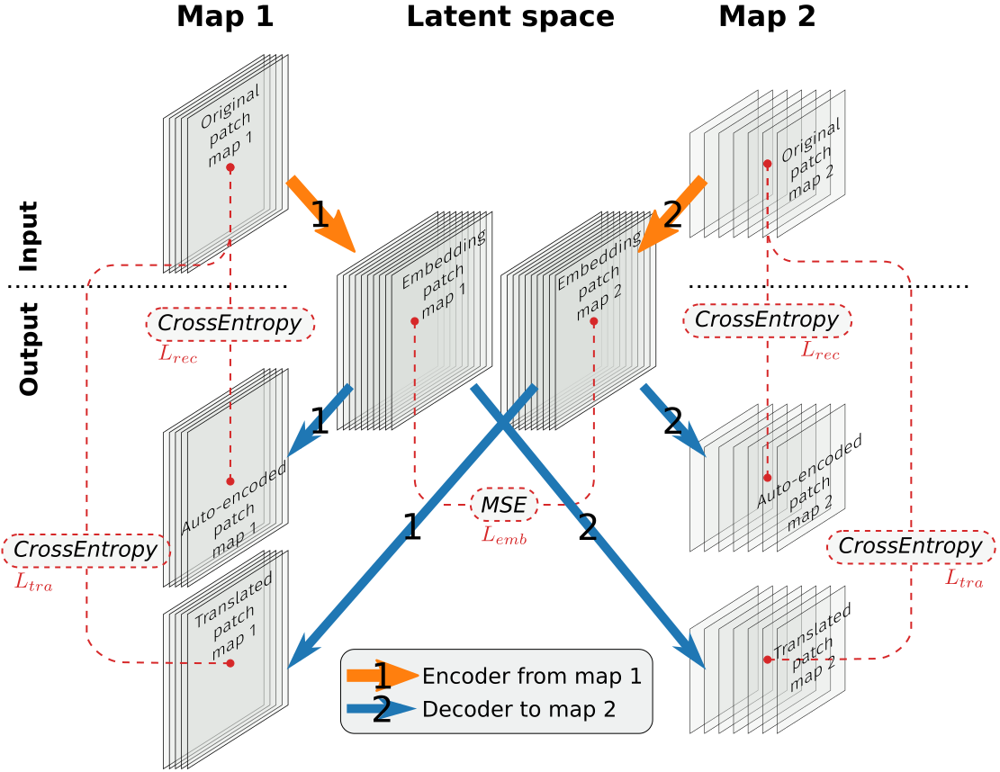

Multiple Map Translation
========================
This repo was forked from [MLULC](https://github.com/LBaudoux/MLULC).
The main purpose of this repository is provide the source code that was used to produce the ECOCLIMAP-SG-ML land cover map, which is used in numerical weather prediction.
Land cover maps are translated thanks to auto-encoders, as illustrated in the following figure.
ECOCLIMAP-SG-ML is obtained by map translation from ESA World Cover to ECOCLIMAP-SG+.



Installation
------------

### Software

The main dependencies of this repository are Pytorch, TorchGeo, Numpy, Pandas, h5py, netCDF4 and Matplotlib.
We recommend to use [Conda](https://docs.conda.io/projects/conda/en/latest/index.html) with the following steps:

1. Create or clone an environment with the [Pytorch installation](https://pytorch.org/get-started/locally/) suiting your machine.
2. In this environment, install the dependencies with `pip install -r requirements.txt`
3. Clone the repository and install the package with `pip install -e .`

### Data
All data is assumed to be found in the `data` folder of the repository.
We recommend to use symbolic links to adapt it to your file system.
The `data` folder should be organised as follows:

```
data
 ├── outputs        -> where the inference output will be stored
 |
 ├── saved_models   -> where the model checkpoints are stored.
 |
 ├── tiff_data      -> where the original land cover maps are stored in TIF format
 |   ├── ECOCLIMAP-SG
 |   ├── ECOCLIMAP-SG-ML
 |   ├── ECOCLIMAP-SG-plus
 |   └── ESA-WorldCover-2021
 |
 └── hdf5_data      -> where the training data is stored
     ├── ecosg.hdf5
     ├── ecosg-train.hdf5
     ├── ecosg-test.hdf5
     ├── ecosg-val.hdf5
     ├── esawc.hdf5
     └── ...
```

To download the data, use the following links, uncompress it and store it as indicated above.

#### All together (recommended)

Using this [link](https://drive.proton.me/urls/9NSPARVBHG#sdRkPZNng72D), you can download all the data you need to use he package over Europe (so-called EURAT domain).
The downloaded volume is 45GB and you will need 160GB locally after decompression.
Due to the large volume of data, we recommend to **download it the day before**.
The data is already organised as explained earlier.
In case you want to focus on some specific part of the data, we provide more detailed information on how to download it separately.
If you download all the data together, you can skip the next subsections of [Data](#data) and go directly to [Check the installation](#check-the-installation).

#### Landcovers

  * ECOCLIMAP-SG-ML: link to [version 0.6](https://drive.proton.me/urls/7H7V6K62KG#dxLVsVJJ1IDm) (750 MB)
  * ECOCLIMAP-SG+: link to [version 0.3.e2](https://drive.proton.me/urls/74EH1BYA8W#tRPWIWhS0i1y) (1.2GB)
  * [ECOCLIMAP-SG](https://opensource.umr-cnrm.fr/projects/ecoclimap-sg/wiki): link to the [EURAT extraction in TIF](https://drive.proton.me/urls/X0QZ18C5X8#XRDMQVNnHGWO)
  * [ESA World Cover](https://esa-worldcover.org/en): link to the [Zenodo archive](https://zenodo.org/records/7254221). Four macro-tiles cover the EURAT domain (43 GB)
```
wget https://zenodo.org/record/7254221/files/ESA_WorldCover_10m_2021_v200_60deg_macrotile_S30W060.zip
wget https://zenodo.org/record/7254221/files/ESA_WorldCover_10m_2021_v200_60deg_macrotile_N30W060.zip
wget https://zenodo.org/record/7254221/files/ESA_WorldCover_10m_2021_v200_60deg_macrotile_S30E000.zip
wget https://zenodo.org/record/7254221/files/ESA_WorldCover_10m_2021_v200_60deg_macrotile_N30E000.zip
unzip '*.zip' -d ESA-WorldCover-2021
```

#### Weights

Here is the [link](https://drive.proton.me/urls/DWJ3ATQS9G#i4GptzWdUnC5) to download the weights (11 MB).

#### Training data

Here is the [link](https://drive.proton.me/urls/AA5KJRYPCC#PD5E1XElNMpG) to download the HDF5 files used in the training (1.8 GB)


### Check the installation

To check the software installation:
```
python tests/import_tests.py
````
To check the data installation:
```
python tests/is_data_there.py [--tiff] [--weights] [--hdf5] [--all]
```


Usage
------

### Visualize maps

Once the landcovers are available in the `data/tiff_data` folder, they can be visualized using the `look_at_map.py` program.
For example, to look at ECOCLIMAP-SG-ML over the EURAT domain with a resolution of 0.1 degrees, the command is:
```
python -i scripts/look_at_map.py --lcname=EcoclimapSGML --domainname=eurat --res=0.1
```
See the header of `look_at_map.py` for more examples.

Alternatively, if you want to export maps in various formats (netCDF, DIR/HDR), the program `scripts/export_landcover.py` has a similar interface.
See the header for more information.


### Make inference

Once the landcover and the weights are correctly installed, you can perform inference on any domain for which ESA World Cover is available.
The program to make the inference is `scripts/inference_and_merging.py`.
```
python drafts/inference_and_merging.py
python -i scripts/look_at_map.py --lcpath=<path given by the  previous program>
```
See the documentation inside to run it.


### Reproduce results

The results presented in the manuscript can be reproduces thanks to the programs `scripts/scores_from_inference.py` and `scripts/qualitative_evaluation.py`.
```
python -i scripts/qualitative_evaluation.py
python -i scripts/scores_from_inference.py
```
See the documentation and variables inside.

### Train the model

To train the model, make sure you have set the correct parameters in a config file (a template is provide in the `config` directory).
Point to this config file in the `run.sh` program.
Then, just launch `./run.sh`.


More infos
-----------

### Repository organisation

The repository has the following directories:
  * `assets`: contains images for the documentation
  * `configs`: contains the various configuration (YAML files) for the training
  * `data`: contains all the data, as described earlier in this README
  * `drafts`: contains draft programs using the package
  * `experiments`: contains all the files created when training a model (logs, checkpoints, visualizations...)
  * `mmt`: contains the source code of the MMT package
  * `questions`: contains programs providing answers to specific questions
  * `tests`: contains programs to test the installation
  * `scripts`: contains programs ready for use

Specifically, the `mmt` folder will set the organisation of the MMT package in modules and sub-modules which are as follows:
```
mmt
├── agents
│   ├── __init__.py
│   ├── base.py
│   ├── multiLULC.py
│   └── TranslatingUnet_vf.py
├── datasets
│   ├── __init__.py
│   ├── landcovers.py
│   ├── landcover_to_landcover.py
│   └── transforms.py
├── graphs
│   ├── __init__.py
│   ├── models
│   │   ├── __init__.py
│   │   ├── custom_layers
│   │   │   ├── __init__.py
│   │   │   ├── double_conv.py
│   │   │   ├── down_block.py
│   │   │   └── up_block.py
│   │   ├── attention_autoencoder.py
│   │   ├── embedding_mixer.py
│   │   ├── position_encoding.py
│   │   ├── transformer_embedding.py
│   │   ├── translating_unet.py
│   │   └── universal_embedding.py
├── inference
│   ├── __init__.py
│   ├── io.py
│   └── translators.py
└── utils
    ├── __init__.py
    ├── config.py
    ├── dirs.py
    ├── domains.py
    ├── image_type.py
    ├── misc.py
    ├── plt_utils.py
    ├── scores.py
    └── tensorboardx_utils.py
```
The modules `agents`, `graphs`, `datasets` and `utils` are mostly inherited from the MLULC repository.
The other modules are specific additions for the ECOCLIMAP-SG-ML generation.


### Class diagrams

Two modules contain customised families of classes for which we provide the inheritance diagram here.

Landcovers are used to access the data from multiple TIF files:
```
mmt.datasets.landcovers
├── OpenStreetMap
└── torchgeo.datasets.RasterDataset  (-> https://torchgeo.readthedocs.io/en/v0.4.1/api/datasets.html#rasterdataset)
    ├── TorchgeoLandcover
    |   ├── EcoclimapSG
    |   ├── ESAWorldCover
    |   └── EcoclimapSGplus
    |       ├── QualityFlagsECOSGplus
    |       ├── InferenceResults
    |       └── EcoclimapSGML
    |   
    └── ProbaLandcover
        └── InferenceResultsProba
```

Translators are used to perform map translation in inference mode:
```
mmt.inference.translators
 └── MapTranslator
     ├── EsawcToEsgp
     |    └── EsawcToEsgpProba
     ├── EsawcEcosgToEsgpRFC
     ├── MapMerger
     └── MapMergerProba
```


### Acknowledgement

Thanks to
  * [Geoffrey Bessardon](https://github.com/gbessardon) for creating the ECOCLIMAP-SG+ map and providing early releases, used as a reference in this work.
  * [Luc Baudoux](https://github.com/LBaudoux) for the initial implementation of the map translation network and the training data.
  * [Met \'Eireann](https://www.met.ie/about-us) for providing the computing facilities for this work.


### License:
This project is licensed under MIT License. See the LICENSE.txt file for details
